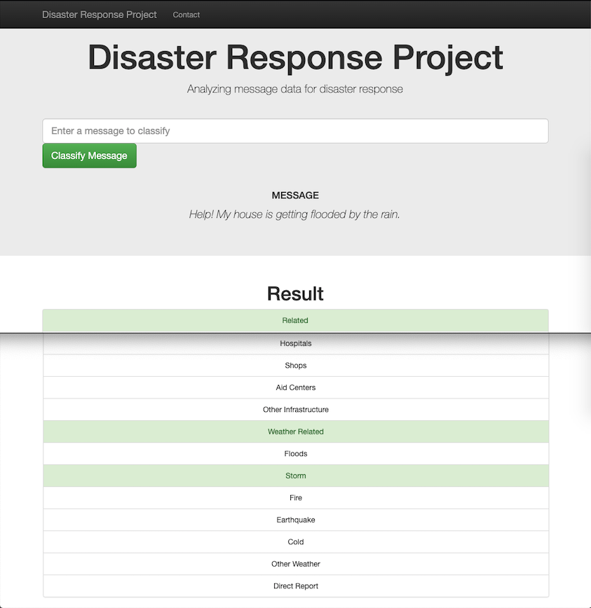

# Analysis of text messages for Disaster Response 

## ETL pipeline | NLP Machine Learning pipeline | Flask Web App

 

> Example of message classification:

  

## Business motivation

    
## Data Science motivation

## Use Jupyter Notebook

## Python version

3.7.1 (default, Oct 23 2018, 14:07:42) 

## Python libraries

The Jupyter Notebook and the Python modules require the following Python libraries:

## Acknowledgments

- Figure 8?

- [Udacity: Data Scientist Nanodegree program](https://www.udacity.com/course/data-scientist-nanodegree--nd025)

- Jupyter Documentation: [Installing Jupyter Notebook](https://jupyter.readthedocs.io/en/latest/install.html)

## Author

Juan Carlos Lopez

- jc.lopezh@gmail.com
- [GitHub](https://github.com/jclh/)
- [LinkedIn](https://www.linkedin.com/in/jclopezh/)

## Contributing

1. Fork it (https://github.com/jclh/NLP-disaster-response/fork)
2. Create your feature branch (git checkout -b feature/fooBar)
3. Commit your changes (git commit -am 'Add some fooBar')
4. Push to the branch (git push origin feature/fooBar)
5. Create a new Pull Request

